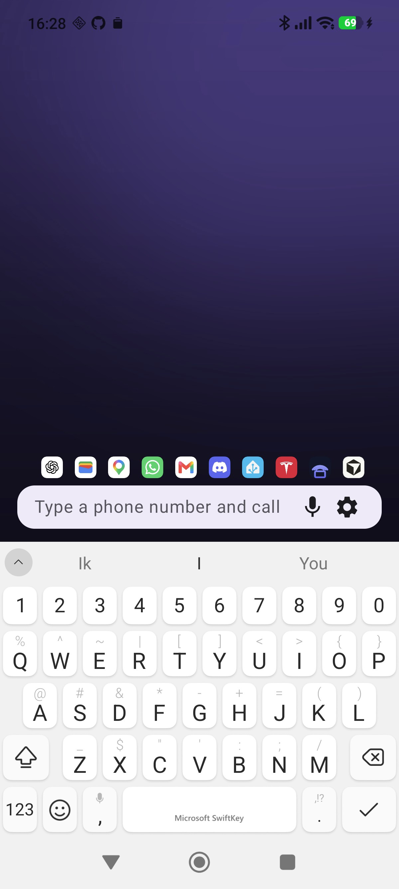
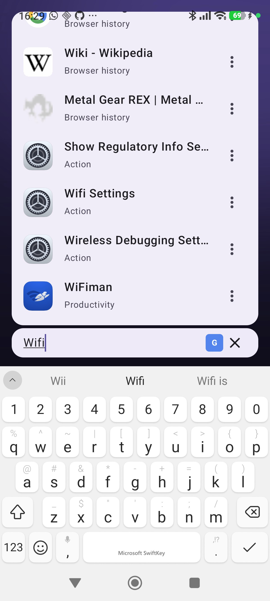
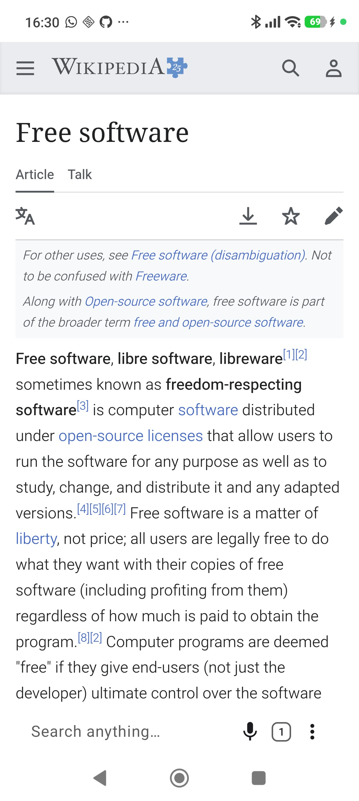
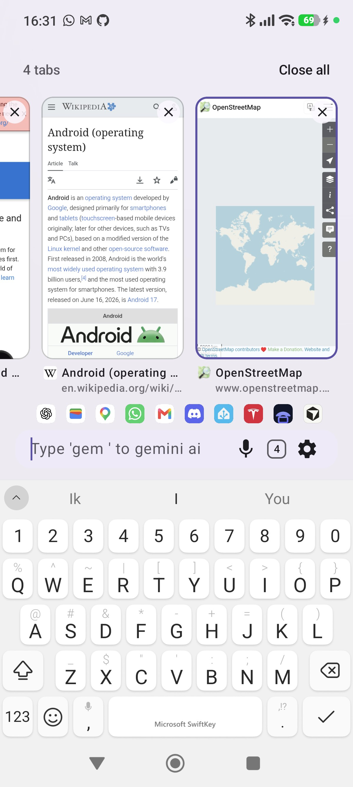
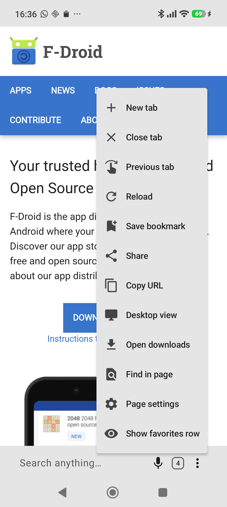
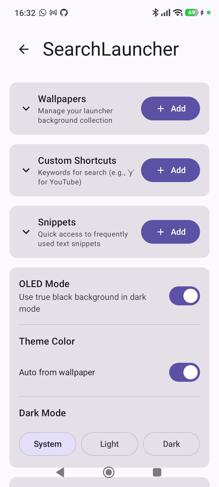

# SearchLauncher

Android app that lets you search everything on your phone and on the web, and opens what you find in its own ad-blocking browser.

## Features

- **Direct keyboard access** - Your homescreen now has a keyboard!
- **Search everything on your phone** - Apps, their shortcuts, device settings, sorted smartly by usage.
- **Search everything on the web** - Youtube, google, bing, maps, spotify... Or add your own custom shortcuts!
- **Built-in ad-free browser** - Opens web results in-app, blocking ads and trackers by default. Browse privately in an isolated window.
- **Tabs at your thumb** - Swipe the search bar sideways to switch tabs, or up to see them all as live previews. Both work from the home screen too: swipe sideways to drop straight back into your last tab.
- **Bookmarks & history** - Save any page under a title you choose, then find it back from the search bar. Pages you visit are searchable too, and both show the site's icon.
- **Speed** - Lightweight, fast!
- **Swipe Wallpapers** - Your background is an interactive picture album.
- **Smart input** - Recognizes phone numbers, emails, calculator queries, and web addresses.
- **App icons history & favorites** - Recently used & favorited apps are shown above the search bar
- **Widgets** - Add widgets through the search bar, resize them, and toggle visibility by tapping the background
- **Voice search** - Tap the mic to speak your query
- **Snippets** - Fast access to frequently used text snippets
- **Quick Access to notification bar & quick settings** - Swipe down on the home screen background to open notifications or quick settings.
- **Export & Import** - Backup your settings and wallpapers

## Screenshots

<p float="left">
  
  
  
  
  
  
</p>

## Use as Launcher or as a Widget

- **Launcher** - Use it as your default homescreen
- **Widget** - Add the most powerful search bar to your existing launcher / homescreen

## Architecture

- **Kotlin** - 100% Kotlin codebase
- **Jetpack Compose** - Modern declarative UI
- **Material 3** - Latest Material Design components
- **AppSearch API** - For efficient content indexing and search
- **DataStore** - For preferences management

## Requirements

- Android 10 (API 29) or higher
- Permissions:
  - Usage stats (optional, for smart app sorting)
  - Contacts (optional, for contact search)

## Building

### Prerequisites

- JDK 17 (LTS, is recommended for Android development)
- Android SDK with API 36

### Build Instructions

```bash
git clone https://github.com/ontola/searchlauncher.git
cd searchlauncher
# Format code
./gradlew spotlessApply
# Install to connected device over ADB
./gradlew installDebug
# Run tests
./gradlew test
# Build APK
./gradlew assembleRelease
# Sign APK
./gradlew signRelease
# Install signed APK
./gradlew installRelease
```

### Releasing

`versionCode` and `versionName` are plain literals in `app/build.gradle.kts` because F-Droid
parses them straight out of that file. Bump both, add a changelog under
`fastlane/metadata/android/en-US/changelogs/<versionCode>.txt`, then tag. See
[DISTRIBUTION.md](DISTRIBUTION.md).

## Known Limitations

- Content search within apps requires apps to implement AppSearch indexing
- Content search within third-party apps requires those apps to expose indexable data

## Contributing

Contributions are welcome! Please feel free to submit a Pull Request.

Before submitting, please run: `./gradlew spotlessApply`

## License

This project is open source. See LICENSE file for details.
